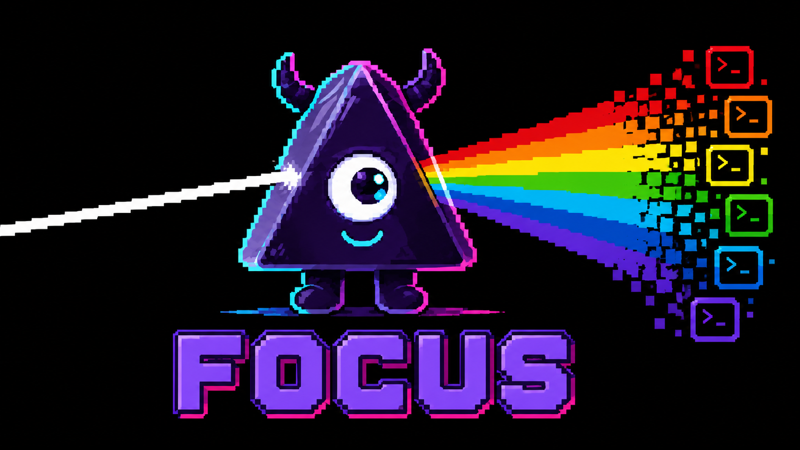
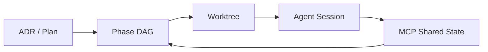

<p align="center">
  
</p>

<p align="center">
  <strong>A terminal-native execution workbench for parallel agent development.</strong><br>
  <strong>面向并行 Agent 开发的终端原生执行工作台</strong>
</p>

<p align="center">
  Stop juggling terminals. Run multiple coding agents across multiple git worktrees<br>
  without losing control of context, dependencies, and handoff.<br>
  不再在终端间疲于奔命。在多个 Git worktree 上并行运行多个编码 Agent，<br>
  同时保持上下文、依赖关系与交接的完全可控。
</p>

<p align="center">
  <a href="README.zh.md">简体中文</a> ·
  <a href="#quickstart">Quick Start</a> ·
  <a href="#key-features">Features</a> ·
  <a href="docs/architecture/">Architecture</a> ·
  <a href="docs/releases/">Releases</a>
</p>

<p align="center">
  <a href="https://github.com/RollingTheRock/focus-tui/actions/workflows/go-test.yml"></a>
  <a href="https://github.com/RollingTheRock/focus-tui/releases"></a>
  <a href="LICENSE"></a>
  <a href="go.mod"></a>
</p>

<p align="center">
  <a href="https://github.com/RollingTheRock/focus-tui/stargazers"></a>
  <a href="https://github.com/RollingTheRock/focus-tui/issues"></a>
  <a href="https://github.com/RollingTheRock/focus-tui/pulls"></a>
</p>

<p align="center">
  <video src="https://private-user-images.githubusercontent.com/249453433/608074885-2c9041e7-cdd7-4aaf-9a51-89735c9d0936.mp4" width="860" autoplay loop muted playsinline></video>
</p>

<p align="center"><i>Launch. Observe. Orchestrate.</i></p>

## Why focus

Running multiple agents across multiple worktrees quickly turns your terminal into a control tower with no radar:

- **Ownership fades** — several agents run, but it is unclear who owns which task.
- **Dependencies break silently** — one agent finishes, the next never starts.
- **State scatters** — worktrees evolve, but the task-to-branch map drifts.
- **Handoff fails** — when you switch sessions, context is lost and you start over.

`focus` does not replace your agents. It gives them a shared execution system.

## Key Features

**◆ Worktree-native execution**  
Each phase runs in its own isolated git worktree. Branches stay clean, context stays local.

**◇ Agent-neutral orchestration**  
Plug in the agents you already trust. No lock-in to a single model or vendor.

**▣ Phase-driven DAG**  
Humans steer at the phase level; agents schedule their own steps. Dependencies flow automatically.

**◉ Shared context protocol**  
Agents read and write the same state through MCP. No manual handover between sessions.

**◆ Agent Store**  
`focus` detects the agents you already have — Claude, Codex, Kimi, OpenCode, Gemini — and lets you enable, register, or discover more.

**◇ Trellis-aware context**  
Optional integration with [Trellis](https://github.com/mindfold-ai/trellis) gives every worktree durable specs, PRDs, workflow state, and handoff journals.

**▣ Structured handoff**  
Session summaries capture progress, blockers, and decisions so the next agent or human can continue without starting over.

**◉ Terminal-native TUI**  
Built for the shell. Fast, keyboard-driven, no browser required.

## Quickstart

```bash
# Install
go install github.com/RollingTheRock/focus-tui/cmd/focus@latest

# Run inside a git repository
cd your-project
focus
```

focus launches with a live dashboard. Press `Tab` to move focus between the DAG, worktree list, and detail panes. Press `?` to see the help overlay, and `S` to open the Agent Store.

## Agent-Neutral, Operator Sovereign

`focus` does not replace your agents. It does not pick winners between models, vendors, or interfaces.

The **Agent Store** scans your system for the agent binaries you already use — Claude Code, Codex, Kimi CLI, OpenCode, Gemini CLI, and more — and lets you enable, disable, or register custom agents. Recommended agents come with one-line install hints, never bundled.

If you use [Trellis](https://github.com/mindfold-ai/trellis), `focus` keeps every worktree’s specs, PRDs, workflow state, and handoff journals in sync. Agents start from structured intent, not conversational memory.

You choose the best tool for the moment. `focus` keeps the system coherent.

### A note on Kimi Code

While `focus` stays agent-neutral, the author's daily driver is **[Kimi Code](https://github.com/MoonshotAI/kimi-code)**. `focus` includes a first-class integration layer for Kimi Code: the `.kimi/hooks/session-start.py` hook automatically injects the current Trellis task context into every Kimi Code session, so the agent starts from structured intent rather than an empty workspace.

## Architecture at a Glance



`focus` treats the worktree as the execution container, the DAG as the source of truth, and MCP as the shared context protocol. Agents run in their native terminals; `focus` coordinates them.

For the full architecture, see [`docs/architecture/`](docs/architecture/).

## Installation

| Method | Command |
|---|---|
| Go install | `go install github.com/RollingTheRock/focus-tui/cmd/focus@latest` |
| Release binary | Download from [GitHub Releases](https://github.com/RollingTheRock/focus-tui/releases) |
| Build from source | `git clone https://github.com/RollingTheRock/focus-tui.git && cd focus-tui && go build ./cmd/focus` |

**Requirements**

- Go 1.25+
- Unix-like terminal environment recommended
- macOS / Linux

## Configuration

`focus` keeps project state in a `.focus/` directory inside your repository and user-level preferences in `~/.config/focus/config.yaml`.

```yaml
# ~/.config/focus/config.yaml
agent:
  external_terminal: true      # launch agents in an external terminal
  terminal_emulator: kitty     # auto-detected if left empty
  research_provider: kimi
  architecture_provider: claude
  coding_provider: "codex,kimi,claude"

editor:
  command: nvim
```

- `~/.config/focus/config.yaml` — editor, theme, MCP transport, store backend.
- `.focus/focus.db` — SQLite database for tasks, sessions, and worktree context (default).

See [`docs/architecture/`](docs/architecture/) for the full architecture and protocol documentation.

## Philosophy

1. **Human sovereign** — humans own decisions; agents execute.
2. **Agent native** — multi-agent parallelism is the default, not an afterthought.
3. **Structure first** — ADR → Plan → Task → Session is operational scaffolding.
4. **Terminal realism** — real engineering happens in shell, git, worktree, and scripts.
5. **Auditable execution** — progress must be inspectable, reproducible, and reversible.

## Who focus Is For

If you only need a single-agent chat surface, `focus` may feel heavy.

If you are running **multi-worktree, multi-agent, parallel software execution** and need control instead of terminal chaos, `focus` is built for you.

## Related Projects

- **[Kimi Code](https://github.com/MoonshotAI/kimi-code)** — the author's preferred terminal-native coding agent. `focus` ships a `SessionStart` hook that injects Trellis context into every Kimi Code session.
- **[Trellis](https://github.com/mindfold-ai/trellis)** — durable specs, PRDs, workflow state, and handoff journals for every worktree. Optional but recommended.

## Documentation

- [`docs/architecture/`](docs/architecture/) — system design and protocols.
- [`docs/adr/`](docs/adr/) — architecture decision records.
- [`docs/plans/`](docs/plans/) — migration plans (currently no active plans; historical plans archived).
- [`docs/releases/`](docs/releases/) — release notes and process.

## License

[Apache-2.0](LICENSE)
