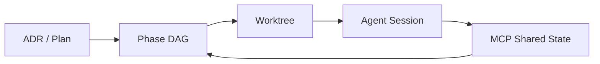

<p align="center">
  
</p>

<p align="center">
  <strong>面向并行 Agent 开发的终端原生执行工作台</strong>
</p>

<p align="center">
  不再在终端间疲于奔命。在多个 Git worktree 上并行运行多个编码 Agent，<br>
  同时保持上下文、依赖关系与交接的完全可控。
</p>

<p align="center">
  <a href="README.md">English</a> ·
  <a href="#快速开始">快速开始</a> ·
  <a href="#核心功能">核心功能</a> ·
  <a href="docs/architecture/">架构</a> ·
  <a href="docs/releases/">发布</a>
</p>

<p align="center">
  <a href="https://github.com/RollingTheRock/Focus-tui/actions/workflows/go-test.yml"></a>
  <a href="https://github.com/RollingTheRock/Focus-tui/releases"></a>
  <a href="LICENSE"></a>
  <a href="go.mod"></a>
</p>

<p align="center">
  <a href="https://github.com/RollingTheRock/Focus-tui/stargazers"></a>
  <a href="https://github.com/RollingTheRock/Focus-tui/issues"></a>
  <a href="https://github.com/RollingTheRock/Focus-tui/pulls"></a>
</p>

<p align="center">
  <video src="https://private-user-images.githubusercontent.com/249453433/608074885-2c9041e7-cdd7-4aaf-9a51-89735c9d0936.mp4" width="860" autoplay loop muted playsinline></video>
</p>

<p align="center"><i>启动。观察。编排。</i></p>

## 为什么需要 focus

当你在多个 worktree 上同时运行多个 Agent 时，终端很快就会变成一座没有雷达的指挥塔：

- **归属模糊** —— 多个 Agent 同时在跑，但谁也不清楚各自负责哪个任务。
- **依赖静默断裂** —— 一个 Agent 完成了，下一个却迟迟没有启动。
- **状态散落各处** —— worktree 不断演化，但任务与分支的对应关系逐渐漂移。
- **交接失败** —— 切换 Session 时，上下文丢失，一切从头再来。

`focus` 不替代你的 Agent。它为它们提供一个共享的执行系统。

## 核心功能

**◆ Worktree 原生执行**  
每个 Phase 在独立的 Git worktree 中运行，分支保持干净，上下文就地沉淀。

**◇ Agent 中立编排**  
接入你已信任的 Agent，不被任何单一模型或厂商锁定。

**▣ Phase 驱动 DAG**  
人类在 Phase 层面掌舵，Agent 自主调度具体 Step，依赖自动流转。

**◉ 共享上下文协议**  
Agent 通过 MCP 读写同一状态，Session 之间无需手动交接。

**◆ Agent Store**  
`focus` 自动检测你系统中已安装的 Agent —— Claude、Codex、Kimi、OpenCode、Gemini —— 并支持启用、注册或发现更多。

**◇ Trellis 感知上下文**  
可选集成 [Trellis](https://github.com/mindfold-ai/trellis)，为每个 worktree 提供持久的 Spec、PRD、工作流状态与交接日志。

**▣ 结构化交接**  
Session 摘要记录进度、阻塞与决策，让下一个 Agent 或人类无需从头开始。

**◉ 终端原生 TUI**  
为 shell 而生，键盘驱动，无需浏览器。

## 快速开始

```bash
# 安装（本仓库为 private，需要设置 GOPRIVATE）
export GOPRIVATE=github.com/RollingTheRock/Focus-tui
go install github.com/RollingTheRock/Focus-tui/cmd/focus@latest

# 在 Git 仓库中运行
cd your-project
focus
```

`focus` 启动后会显示实时仪表板。按 `Tab` 在 DAG、worktree 列表和详情面板之间切换焦点，按 `?` 查看帮助浮层，按 `S` 打开 Agent Store。

## Agent 中立，操作者主权

`focus` 不替代你的 Agent，也不在模型、厂商或接口之间站队。

**Agent Store** 会扫描你系统中已安装的 Agent 二进制 —— Claude Code、Codex、Kimi CLI、OpenCode、Gemini CLI 等 —— 让你自由启用、禁用或注册自定义 Agent。推荐 Agent 仅提供一行安装提示，从不捆绑。

如果你使用 [Trellis](https://github.com/mindfold-ai/trellis)，`focus` 会同步每个 worktree 的 Spec、PRD、工作流状态与交接日志。Agent 从结构化意图出发，而不是依赖对话记忆。

你根据当下场景选择最合适的工具，`focus` 让系统保持连贯。

### 关于 Kimi Code

虽然 `focus` 保持 Agent 中立，但作者日常最常用的 Agent 是 **[Kimi Code](https://github.com/MoonshotAI/kimi-code)**。`focus` 为 Kimi Code 提供了一流集成：`.kimi/hooks/session-start.py` 钩子会在每次 Kimi Code 会话启动时自动注入当前 Trellis 任务上下文，让 Agent 从结构化意图出发，而不是面对空白工作区。

## 架构一览



`focus` 将 worktree 视为执行容器，DAG 视为真相来源，MCP 视为共享上下文协议。Agent 在各自原生终端中运行，`focus` 负责协调它们。

完整架构请见 [`docs/architecture/`](docs/architecture/)。

## 安装

| 方式 | 命令 |
|---|---|
| Go install | `export GOPRIVATE=github.com/RollingTheRock/Focus-tui && go install github.com/RollingTheRock/Focus-tui/cmd/focus@latest` |
| Release 二进制 | 从 [GitHub Releases](https://github.com/RollingTheRock/Focus-tui/releases) 下载 |
| 源码构建 | `git clone https://github.com/RollingTheRock/Focus-tui.git && cd focus-tui && go build ./cmd/focus` |

**环境要求**

- Go 1.25+
- 使用 `go install` 时需要本 private 仓库的读取权限（SSH key 或 PAT）
- `GOPRIVATE=github.com/RollingTheRock/Focus-tui`，让 Go 工具链直接从 GitHub 拉取
- 推荐使用类 Unix 终端环境
- macOS / Linux

## 配置

`focus` 将项目状态保存在仓库内的 `.focus/` 目录中，用户级偏好设置保存在 `~/.config/focus/config.yaml`。

```yaml
# ~/.config/focus/config.yaml
agent:
  external_terminal: true      # 在外部终端启动 Agent
  terminal_emulator: kitty     # 留空则自动检测
  research_provider: kimi
  architecture_provider: claude
  coding_provider: "codex,kimi,claude"

editor:
  command: nvim
```

- `~/.config/focus/config.yaml` —— 编辑器、主题、MCP 传输层、存储后端。
- `.focus/focus.db` —— SQLite 数据库，用于任务、Session 与 worktree 上下文（默认）。

完整架构与协议文档请见 [`docs/architecture/`](docs/architecture/)。

## 设计哲学

1. **人类主权** —— 人类拥有决策权，Agent 负责执行。
2. **Agent 原生** —— 多 Agent 并行是默认，而非事后补丁。
3. **结构优先** —— ADR → Plan → Task → Session 是运营骨架，不是装饰。
4. **终端现实主义** —— 真正的工程发生在 shell、git、worktree 和脚本中。
5. **可审计执行** —— 进度必须可检查、可复现、可回退。

## focus 适合谁

如果你只需要一个单 Agent 聊天界面，`focus` 可能显得太重。

如果你在运行 **多 worktree、多 Agent、并行软件执行**，并且需要控制而非终端混乱，`focus` 就是为你而建。

## 相关项目

- **[Kimi Code](https://github.com/MoonshotAI/kimi-code)** —— 作者首选的终端原生编码 Agent。`focus` 内置 `SessionStart` 钩子，为每个 Kimi Code 会话注入 Trellis 上下文。
- **[Trellis](https://github.com/mindfold-ai/trellis)** —— 为每个 worktree 提供持久的 Spec、PRD、工作流状态与交接日志。可选但推荐。

## 文档

- [`docs/architecture/`](docs/architecture/) —— 系统设计与协议。
- [`docs/adr/`](docs/adr/) —— 架构决策记录。
- [`docs/plans/`](docs/plans/) —— 迁移计划（当前无活跃计划；历史计划已归档）。
- [`docs/releases/`](docs/releases/) —— 发布说明与流程。

## 许可

[Apache-2.0](LICENSE)
