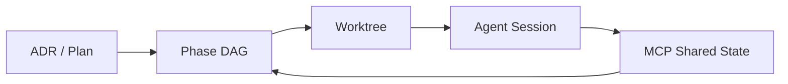

# focus README Redesign Design

## 1. Background & Goal

`focus` is approaching a public-facing release on GitHub. The current `README.md` is accurate but reads like an internal positioning document: it is strong on philosophy and architecture, weak on immediate proof, and lacks the visual/demo evidence that TUI/CLI projects need to convert visitors into users.

The goal of this redesign is to produce a README that:
- Communicates the core value of `focus` in the first 10 seconds.
- Gets a developer from "curious" to "running" within 3 minutes.
- Showcases the v0.2 product evolution with elegance and product craft.
- Embodies the product thesis: **agent-neutral, operator-sovereign, ecosystem-native**.

Two deliverables:
- `README.md` — English primary version.
- `README.zh.md` — Chinese version with identical structure and cross-linking.

## 2. Target Audience & Context

- **Primary channel:** GitHub public repository page.
- **Target reader:** Senior engineers, tech leads, and AI-native developers who already run multiple coding agents (Kimi CLI, Claude Code, Codex, OpenCode, Gemini CLI, etc.) and feel the pain of parallel terminal chaos.
- **Tone:** Confident, restrained, technical but not academic. Avoid hype. Show rather than tell.
- **Success metric:** A visitor should understand what `focus` is, why it exists, and how to run it before scrolling past the second screen.

## 3. Design Principles

1. **Visual proof first.** A TUI product must show its interface immediately. GIF + Asciinema are non-negotiable.
2. **Hook → Prove → Enable → Extend.** Follow the conversion structure of high-quality CLI projects (lazygit, aider, k9s).
3. **Terminology in layers.** Introduce no more than 2–3 new concepts above the fold. Move MCP, DAG, ADR, Phase/Step hierarchy deeper.
4. **Ecosystem over bundle.** Emphasize that `focus` does not ship agents or models. It integrates with what the user already has.
5. **English primary, Chinese companion.** The Chinese README is not a translation; it is a culturally adapted version with the same information architecture.
6. **README as an entry point, not a manual.** Deep architecture, ADRs, and release process live in `docs/` and are linked, not inlined.

## 4. File Structure

```text
README.md           # English version
README.zh.md        # Chinese version
docs/
  assets/
    focus-logo.png          # Hero logo (PNG)
    focus-demo.mp4          # Looping MP4 hero demo video
    focus-workflow.cast     # Asciinema source file
```

Assets are committed to the repo, but the Asciinema player link may point to an uploaded recording on asciinema.org.

## 5. Module Architecture

### 5.1 Hero Section

**Position:** First screen.
**Purpose:** Communicate identity and value in under 10 seconds.

```markdown
# focus

> Stop juggling terminals.  
> Run parallel agent development without losing control.

`focus` is a terminal-native execution workbench for teams who run multiple coding agents across multiple git worktrees — and need to keep the system observable, coherent, and auditable.

[](https://github.com/RollingTheRock/focus-tui/actions/workflows/go-test.yml)
[](https://github.com/RollingTheRock/focus-tui/releases)
[](LICENSE)
[](go.mod)
```

**Notes:**
- Keep badges to one line. Avoid download counters until release distribution is mature.
- Tagline remains "Stop juggling terminals." — it is the strongest existing asset.

### 5.2 10-Second GIF Demo

**Position:** Immediately below hero.
**Purpose:** Prove the product looks and feels good.

**Visual script:**
1. Terminal prompt: `focus`.
2. TUI launches. Clean pane layout renders.
3. Worktree pane: 2–3 worktrees listed.
4. Press `a` on first worktree → external terminal opens, labeled "Kimi".
5. Press `a` on second worktree → external terminal opens, labeled "Codex".
6. Dashboard pane updates: two phases shown as `active`.
7. Footer shows global hints and a subtle notification.

**Production notes:**
- Terminal theme: Tokyo Night or Catppuccin.
- Font: JetBrains Mono or Maple Mono.
- Subtle overlay caption: *Launch. Observe. Orchestrate.*
- No cursor jitter. No fast cuts. Hold each step for ~1.5s.

### 5.3 The Problem

**Position:** Second screen.
**Purpose:** Make the reader feel the pain before offering the cure.

```markdown
## Why focus

Running multiple agents across multiple worktrees quickly turns your terminal into a control tower with no radar:

- **Ownership fades** — several agents run, but it is unclear who owns which task.
- **Dependencies break silently** — one agent finishes, the next never starts.
- **State scatters** — worktrees evolve, but the task-to-branch map drifts.
- **Handoff fails** — when you switch sessions, context is lost and you start over.

`focus` does not replace your agents. It gives them a shared execution system.
```

**Notes:**
- Keep it to four bullets. No mention of MCP, DAG, or Phase here.
- Use scene-setting language rather than abstract claims.

### 5.4 Key Features

**Position:** Second to third screen.
**Purpose:** Translate product mechanisms into user value.

Present as two groups of four features each, using emoji icons only (no external assets).

**Execution Control**

| Icon | Feature | Description |
|------|---------|-------------|
| 🌳 | Worktree-native execution | Each phase runs in its own isolated git worktree. Branches stay clean, context stays local. |
| 🤖 | Agent-neutral orchestration | Plug in the agents you already trust. No lock-in to a single model or vendor. |
| 🔀 | Phase-driven DAG | Humans steer at the phase level; agents schedule their own steps. Dependencies flow automatically. |
| 🧠 | Shared context protocol | Agents read and write the same state through MCP. No manual handover between sessions. |

**Ecosystem Coexistence**

| Icon | Feature | Description |
|------|---------|-------------|
| 🛒 | Agent Store | `focus` detects the agents you already have — Claude, Codex, Kimi, OpenCode, Gemini — and lets you enable, register, or discover more. |
| 🌿 | Trellis-aware context | Optional integration with [Trellis](https://github.com/mindfold-ai/trellis) gives every worktree durable specs, PRDs, workflow state, and handoff journals. |
| 📝 | Structured handoff | Session summaries capture progress, blockers, and decisions so the next agent or human can continue without starting over. |
| 🖥️ | Terminal-native TUI | Built for the shell. Fast, keyboard-driven, no browser required. |

**Notes:**
- This section is where the "ecosystem-native" thesis becomes visible.
- Trellis is described as optional; Agent Store is described as non-bundling.

### 5.5 Quickstart

**Position:** Third screen.
**Purpose:** Get the user running in under 3 minutes.

```markdown
## Quickstart

```bash
# 1. Install
go install github.com/RollingTheRock/focus-tui/cmd/focus@latest

# 2. Run inside a git repository
cd your-project
focus
```

Then press `g` to open the worktree pane, select a worktree, and press `a` to start your first agent session.

> You should see a live dashboard with your repository worktrees on the left and a task DAG on the right.
```

**Notes:**
- `focus` detects the git project root automatically and initializes a `.focus/` directory on first run.
- Use `go install` as the primary path because it is the simplest truthful command today.
- Keep it to two commands. No configuration required for first run.

### 5.6 60-Second Asciinema Workflow

**Position:** Third to fourth screen.
**Purpose:** Show a complete end-to-end workflow, not just a screenshot.

**Title:** *Multi-Agent Parallel Execution with Agent Store*

**Script:**
1. `cd your-project` and run `focus`. The TUI launches and `.focus/` is created automatically.
3. Press `s` to open the Agent Store.
4. Show installed agents detected on the system (e.g., Kimi, Codex) and recommended agents with install hints.
5. Enable Kimi and Codex.
6. Press `g` to open Worktree pane; create worktrees for two phases (`c`).
7. In DAG pane (`t`), press `n` to create two phases: `research` and `implement`.
8. Select `research` worktree, press `a`, choose Kimi → external terminal opens.
9. Select `implement` worktree, press `a`, choose Codex → external terminal opens.
10. Return to Dashboard. Both phases show `active`.
11. Press `?` to reveal global help overlay.
12. One agent emits a summary; the other reads it via MCP.
13. Press `q` to quit.

**Production notes:**
- Upload to asciinema.org and embed with the standard link.
- Keep captions minimal and precise.
- Pace: hold each meaningful state for 2–3 seconds.

### 5.7 Agent-Neutral, Operator Sovereign

**Position:** Fourth screen.
**Purpose:** Explicitly state the product relationship with agents and models.

```markdown
## Agent-Neutral, Operator Sovereign

`focus` does not replace your agents. It does not pick winners between models, vendors, or interfaces.

The **Agent Store** scans your system for the agent binaries you already use — Claude Code, Codex, Kimi CLI, OpenCode, Gemini CLI, and more — and lets you enable, disable, or register custom agents. Recommended agents come with one-line install hints, never bundled.

If you use [Trellis](https://github.com/mindfold-ai/trellis), `focus` keeps every worktree’s specs, PRDs, workflow state, and handoff journals in sync. Agents start from structured intent, not conversational memory.

You choose the best tool for the moment. `focus` keeps the system coherent.
```

**Notes:**
- This paragraph is the product thesis in plain language.
- Link to Trellis repository; do not explain Trellis internals.

### 5.8 Architecture at a Glance

**Position:** Fourth screen.
**Purpose:** Give technical readers a map without overwhelming newcomers.

Use a Mermaid diagram:

```markdown

```

**Followed by:**

```markdown
`focus` treats the worktree as the execution container, the DAG as the source of truth, and MCP as the shared context protocol. Agents run in their native terminals; `focus` coordinates them.

For the full architecture, see [`docs/architecture/`](docs/architecture/).
```

**Notes:**
- Keep the diagram simple. Four nodes are enough.
- Link out to architecture docs for depth.

### 5.9 Installation

**Position:** Fourth to fifth screen.
**Purpose:** Cover all supported installation paths honestly.

```markdown
## Installation

| Method | Command |
|--------|---------|
| **Go install** | `go install github.com/RollingTheRock/focus-tui/cmd/focus@latest` |
| **Release binary** | Download from [GitHub Releases](https://github.com/RollingTheRock/focus-tui/releases) |
| **Build from source** | `git clone ... && go build ./cmd/focus` |

### Requirements

- Go 1.25+
- Unix-like terminal environment recommended
- macOS / Linux
```

**Notes:**
- Do not include Homebrew until a tap exists.
- Be explicit about environment support.

### 5.10 Configuration

**Position:** Fifth screen.
**Purpose:** Show that `focus` is configurable without dumping the full schema.

```markdown
## Configuration

`focus` keeps project state in a `.focus/` directory inside your repository and user-level preferences in `~/.config/focus/config.yaml`.

- `~/.config/focus/config.yaml` — editor, theme, MCP transport, store backend.
- `.focus/focus.db` — SQLite database for tasks, sessions, and worktree context (default).

See [`docs/architecture/configuration.md`](docs/architecture/configuration.md) for the full reference.
```

**Notes:**
- Keep this section short; most users do not need to edit config immediately.
- Verify whether `docs/architecture/configuration.md` exists; if not, link to `docs/architecture/` or `docs/adr/`.

### 5.11 Philosophy

**Position:** Fifth screen.
**Purpose:** State design principles briefly.

```markdown
## Philosophy

1. **Human sovereign** — humans own decisions; agents execute.
2. **Agent native** — multi-agent parallelism is the default, not an afterthought.
3. **Structure first** — ADR → Plan → Task → Session is operational scaffolding.
4. **Terminal realism** — real engineering happens in shell, git, worktree, and scripts.
5. **Auditable execution** — progress must be inspectable, reproducible, and reversible.
```

**Notes:**
- Shortened from the current README. Philosophy belongs in the lower half.

### 5.12 Who focus Is For

**Position:** Sixth screen.
**Purpose:** Filter readers and set expectations.

```markdown
## Who focus Is For

If you only need a single-agent chat surface, `focus` may feel heavy.

If you are running **multi-worktree, multi-agent, parallel software execution** and need control instead of terminal chaos, `focus` is built for you.
```

### 5.13 Documentation, Contributing, License

**Position:** Bottom.
**Purpose:** Community and legal entry points.

```markdown
## Documentation

- [`docs/architecture/`](docs/architecture/) — system design and protocols.
- [`docs/adr/`](docs/adr/) — architecture decision records.
- [`docs/plans/`](docs/plans/) — implementation and migration plans.
- [`docs/releases/`](docs/releases/) — release notes and process.

## Contributing

Contributions are welcome. Please open an issue or pull request. See [`CONTRIBUTING.md`](CONTRIBUTING.md) for guidelines.

## License

[Apache-2.0](LICENSE)
```

**Notes:**
- Verify whether `CONTRIBUTING.md` and `LICENSE` exist before linking.

## 6. Chinese Version Strategy (`README.zh.md`)

- Mirror the English information architecture exactly.
- Translate with cultural adaptation, not literal conversion.
- Keep the tagline "Stop juggling terminals." in English for brand consistency, with a Chinese subtitle.
- Use Simplified Chinese.
- Maintain the same Mermaid diagram and asset references.
- Cross-link at the top: `🇨🇳 中文版` / `🇺🇸 English`.

## 7. Demo Production Checklist

- [x] Provide hero logo (`docs/assets/focus-logo.png`).
- [x] Provide hero demo video (`docs/assets/focus-demo.mp4`).
- [ ] Record Asciinema workflow (`docs/assets/focus-workflow.cast`).
- [ ] Upload Asciinema to asciinema.org and obtain embed link.
- [ ] Verify GIF renders correctly on GitHub dark and light themes.
- [ ] Verify Asciinema link is publicly accessible.

## 8. Open Questions

1. Is the GitHub Actions workflow name `go-test.yml` correct for the CI badge?
2. Which agent binaries are reliably detected by the Agent Store on a clean demo machine?
3. Should `CONTRIBUTING.md` and `LICENSE` be created before linking, or should links be deferred until they exist?
4. Is `docs/architecture/configuration.md` the correct target for configuration documentation?

## 9. Acceptance Criteria

- [ ] `README.md` follows the module order in this spec.
- [ ] `README.zh.md` exists and mirrors the structure.
- [ ] Hero section renders within one screen on desktop GitHub.
- [ ] MP4 demo is embedded and publicly viewable.
- [ ] Quickstart is three commands or fewer.
- [ ] No more than three new concepts appear above the fold.
- [ ] "Agent-neutral" and "ecosystem coexistence" thesis is explicit.
- [ ] Deep architecture content is linked, not inlined.
